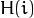
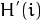
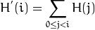
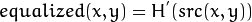

# equalizeHist

- 用OpenCV函数 [equalizeHist](http://opencv.willowgarage.com/documentation/cpp/imgproc_histograms.html?#equalizeHist) 对图像进行直方图均衡化

## 原理

### 图像的直方图

- 直方图是图像中像素强度分布的图形表达方式.
- 它统计了每一个强度值所具有的像素个数.

<div align=center>
  
</div>


### 直方图均衡化

- 直方图均衡化是通过拉伸像素强度分布范围来增强图像对比度的一种方法.
- 说得更清楚一些, 以上面的直方图为例, 你可以看到像素主要集中在中间的一些强度值上. 直方图均衡化要做的就是 *拉伸* 这个范围. 见下面左图: 绿圈圈出了 *少有像素分布其上的* 强度值. 对其应用均衡化后, 得到了中间图所示的直方图. 均衡化的图像见下面右图!

<div align=center>
  
</div>


### 直方图均衡化是怎样做到的

- 均衡化指的是把一个分布 (给定的直方图) *映射* 到另一个分布 (一个更宽更统一的强度值分布), 所以强度值分布会在整个范围内展开.

- 要想实现均衡化的效果, 映射函数应该是一个 *累积分布函数 (cdf)* (更多细节, 参考*学习OpenCV*). 对于直方图 , 它的 *累积分布* 是:


<div align=center>
  
</div>

  要使用其作为映射函数, 我们必须对最大值为255 (或者用图像的最大强度值) 的累积分布  进行归一化. 同上例, 累积分布函数为:

<div align=center>
  
</div>

- 最后, 我们使用一个简单的映射过程来获得均衡化后像素的强度值:

<div align=center>
  
</div>


## 代码解释

1. 声明原图和目标图以及窗体名称:

   ```c++
   Mat src, dst;
   
   char* source_window = "Source image";
   char* equalized_window = "Equalized Image";
   ```

2. 加载源图像:

   ```c++
   src = imread( "cat.jpg", 1 );
   
   if( !src.data )
     { 
       cout<<"Usage: ./Histogram_Demo <path_to_image>"<<endl;
       return -1;
     }
   ```

3. 转为灰度图:

   ```c++
   cvtColor( src, src, CV_BGR2GRAY );
   ```

4. 利用函数 [equalizeHist](http://opencv.willowgarage.com/documentation/cpp/imgproc_histograms.html?#equalizeHist) 对上面灰度图做直方图均衡化:

   ```c++
   equalizeHist( src, dst );
   ```

   可以看到, 这个操作的参数只有源图像和目标 (均衡化后) 图像.

5. 显示这两个图像 (源图像和均衡化后图像) :

   ```c++
   namedWindow( source_window, CV_WINDOW_AUTOSIZE );
   namedWindow( equalized_window, CV_WINDOW_AUTOSIZE );
   
   imshow( source_window, src );
   imshow( equalized_window, dst );
   ```

6. 等待用户案件退出程序

   ```c++
   waitKey(0);
   ```